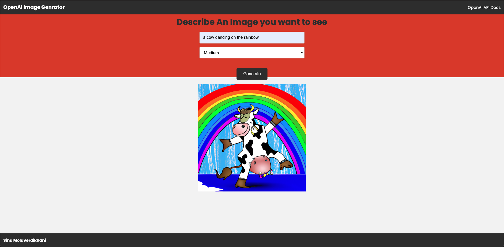
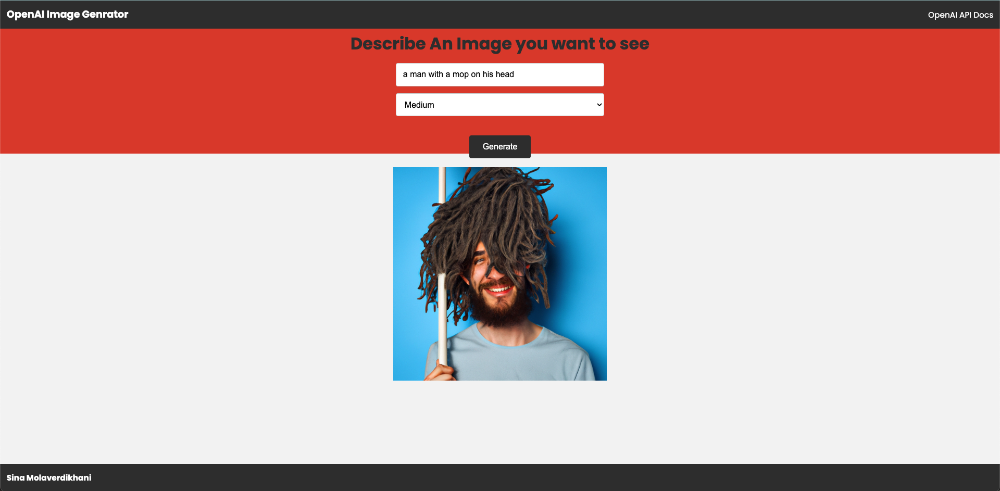

# ai-image-generator
a simple image generator built with Node.js and Express that uses OpenAI's Dall-E models to generate images that a user describe them.




## Usage

Make a `.env`file and put your api key in it with this name: OPENAI_API_KEY.

Generate an API KEY at [OpenAI](https://beta.openai.com/) and add it to the `.env` file.

Install the dependencies

```bash
npm install
```

Run server

```bash
npm start
```

Visit `http://localhost:5000` in your browser.

The endpoint is at `POST http://localhost:5000/openai/generateimage`.